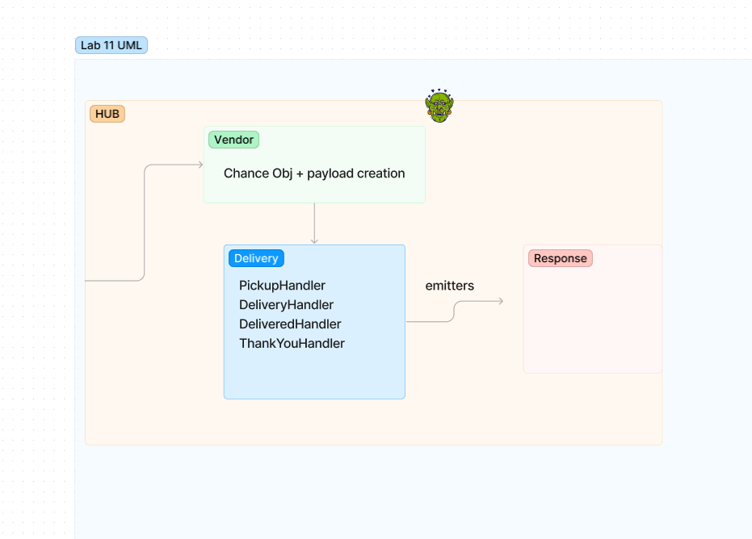
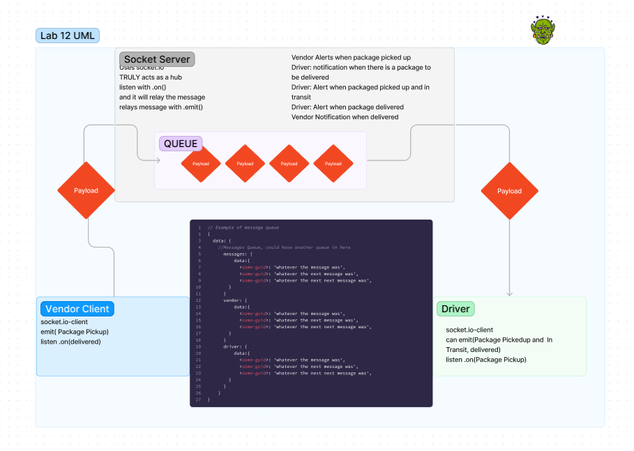

# CAPS System

## Phase 3 Requirements
In Phase 3, we are building a set of features to help manage deliveries made by CAPS Drivers. This will simulate a delivery driver receiving a list of orders from a Queue and “scanning” package codes on delivery. Retailers will be able to see in their dashboard or log, a list of all packages delivered in real time. Should a delivery driver deliver any packages while the retailer is not connected to the dashboard, the vendor client should be guaranteed to receive “delivery” notifications from the Queue system.

Here are the high level stories related to this new set of requirements.

As a vendor, I want to “subscribe” to “delivered” notifications so that I know when my packages are delivered.
As a vendor, I want to “catch up” on any “delivered” notifications that I might have missed so that I can see a complete log.
As a driver, I want to “subscribe” to “pickup” notifications so that I know what packages to deliver.
As a driver, I want to “catch up” on any “pickup” notifications I may have missed so that I can deliver everything.
As a driver, I want a way to “scan” a delivery so that the vendors know when a package has been delivered.
And as developers, here are some of the development stories that are newly relevant to the above.

As a developer, I want to create a system of tracking who is subscribing to each event.
As a developer, I want to place all inbound messages into a “queue” so that my application knows what events are to be delivered.
As a developer, I want to create a system for communicating when events have been delivered and received by subscribers.
As a developer, I want to delete messages from the queue after they’ve been received by a subscriber, so that I don’t re-send them.
As a developer, I want to create a system for allowing subscribers to retrieve all undelivered messages in their queue.
Technical Requirements / Notes
Overview
We are adding a new module to the CAPS Application Server to guarantee that payloads from events are delivered to any Client Module that is listening for specific events. This lab will refactor the Server and Client Modules to persist payloads on the Server side and remove them once received by clients.

Our Server is going to have the same overall functionality, but we want to incorporate a few improvements to existing features:
We want a feature to keep a log of payloads that reach our system, organized by vendor and event type.
Payloads are “published” to the appropriate Clients for the appropriate events.
Client Vendor Applications used by retailers, should subscribe to appropriate Vendor Queues so that they can be alerted when a delivery was made.
The Client can ask for all undelivered messages from a particular Server Queue.
When a Client receives a message, it will need to let the hub server know that it was received.

**User Stories:**
- As a vendor, I want to alert the system when I have a package to be picked up.
- As a driver, I want to be notified when there is a package to be delivered.
- As a driver, I want to alert the system when I have picked up a package and it is in transit.
- As a driver, I want to alert the system when a package has been delivered.
- As a vendor, I want to be notified when my package has been delivered.

**Developer Story:**
- As a developer, I want to create a network event-driven system using Socket.io so that I can write code that responds to events originating from both servers and client applications.

**Technical Requirements / Notes:**
- In order to switch from Node Events to Socket.io, the refactoring process will involve changes to each application to use the core features of Socket.io.

## Overview

The goal of this lab is to create a namespaced Socket.io event server and configure Vendor and Driver Client Modules.

- The Socket Server will create a namespace of `caps` that will receive all CAPS event traffic.
- Each Vendor and Driver Client will connect to the `caps` namespace.
- The server will emit specific events to each socket that is listening for their designated events from the Global Event Pool defined in the Server.
- Each Vendor will only emit and listen for specific events based on their Vendor ID. This will be managed by rooms within Socket.io.
- Each Driver will “pick up” a package when the vendor notifies the Server that an “order” is ready and simulate “in-transit” and “delivered” events.
- The expected output of the 3 running applications is the same as it was in Phase 2.

## Output

Note: This is the heart of refactoring. The end result appears to be the same even after you’ve made a holistic change on the underlying code to be cleaner and faster. As developers, we want to do great work without changing the users’ experience.

## Proposed File Structure

Note: The structure below shows both socket clients and the socket server in the same repo. This is for learning and grading convenience, not a requirement. Realistically, the socket server and each of the socket clients could be independent applications and repos.

### Links and Resources

- [GitHub Actions ci/cd(TBD)](https://github.com/nickmullaney/CAPS/actions) 

# package.json Notes

## For React Applications

To deploy your application at GitHub pages, you'll need to add a home page property to your package.json which points to the deployed base URL of your GitHub Pages site.

*NOTE: This will break deployments to other hosting services such as Netlify, Vercel, or AWS Amplify, so if you later wish to deploy there, remove this property completely.*

```json
{
  "homepage": "https://github.com/nickmullaney/CAPS"
}
```
# To Run

To run the application please use ```node hub.js```

### For Tests

Your scripts section should have the following, so that you can easily run tests locally and in your CI.

```json
  "scripts": {
    "start": "node index.js",
    "test": "jest --verbose --coverage",
    "test-watch": "jest --watchAll --verbose --coverage",
    "init:config": "sequelize init:config",
    "db:create": "sequelize db:create"
},
```

### For NPM Modules

If you are creating a module to deploy at NPM, you'll want a "bin" section that identifies the name of the global command to run and your .js file that runs when called.

```json
"bin": {
    "fetch": "index.js"
}
```

Additionally, that file should have as it's first line, so that it'll run without having to type "node filename.js" every time

`#!/usr/bin/env node`


### Collaborators

Thanks to Reece, Ryan, Ike, Hayden, Kaeden, and Stephen

#### Tests

to run tests after running `npm i`, run the command `npm test` 

#### UML
Lab 11


Lab 12


Lab 13
